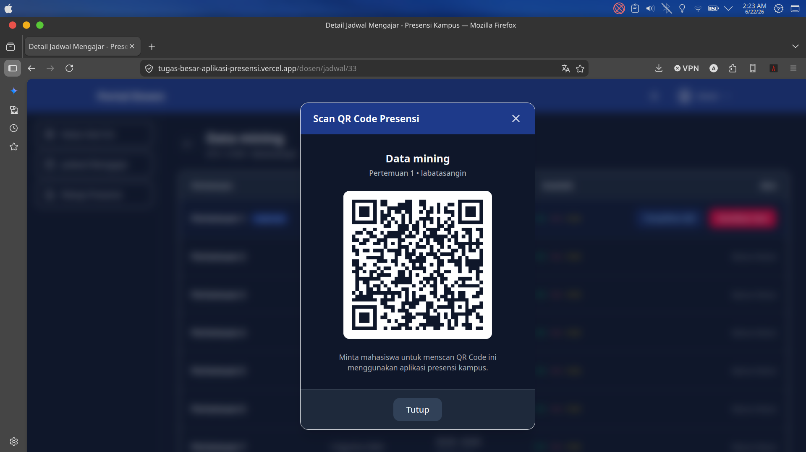
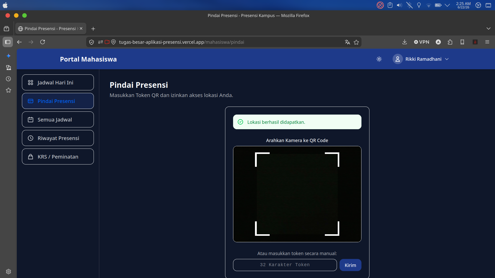
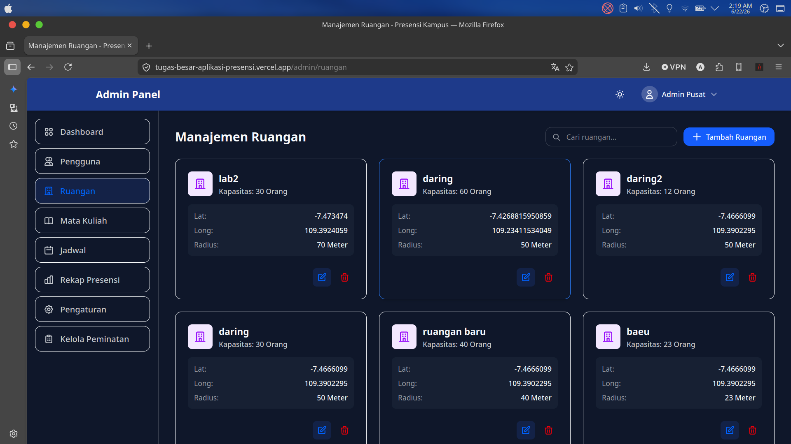
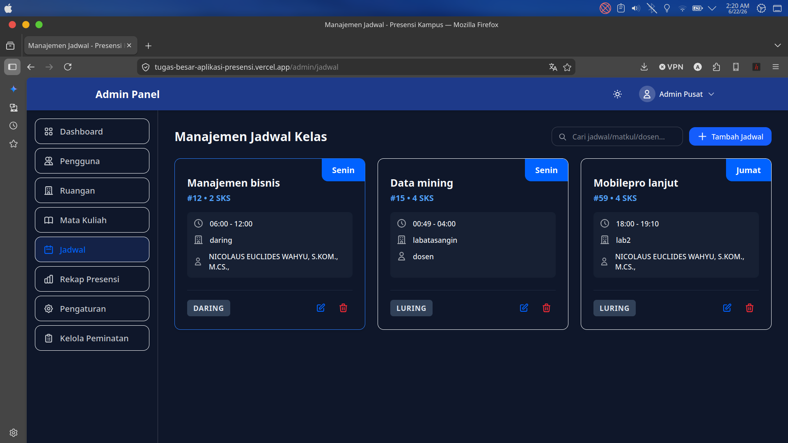
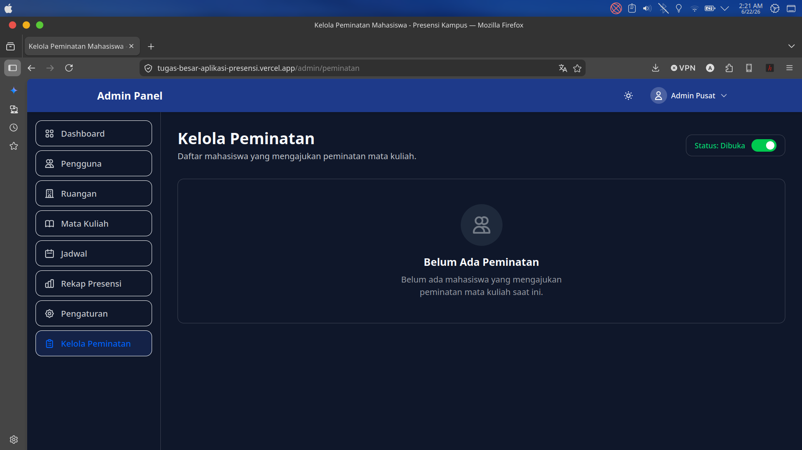
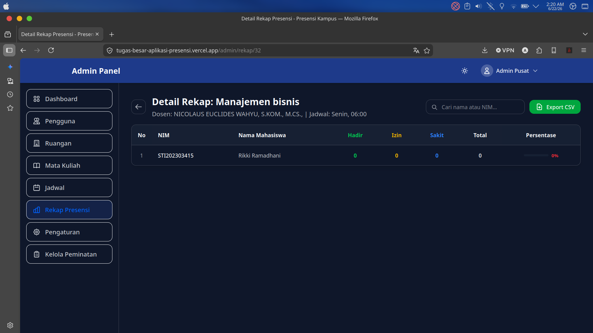
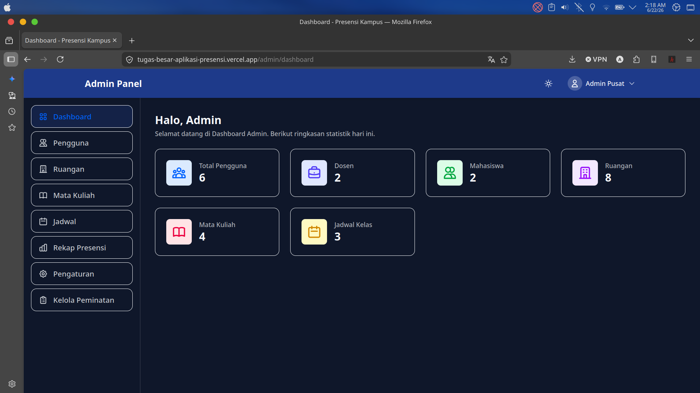
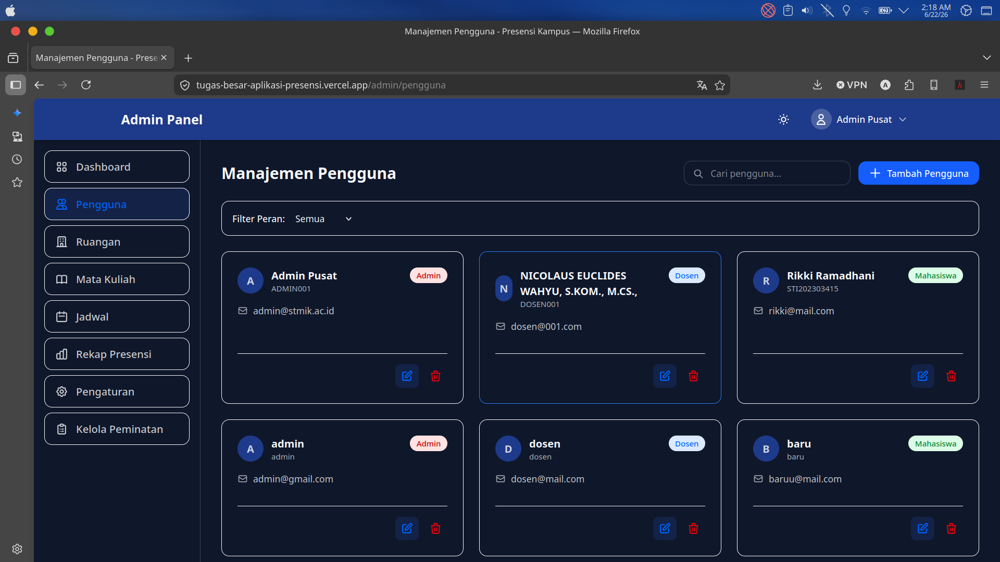
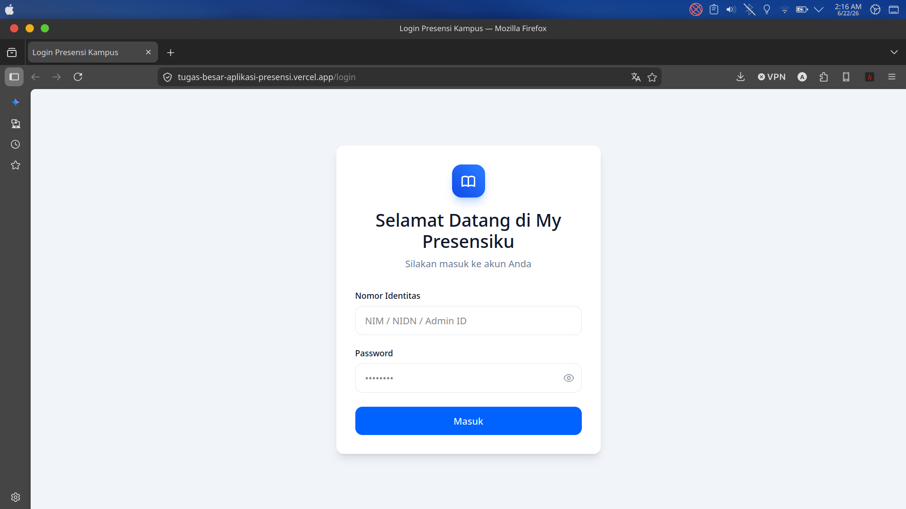

# 📘 PRESENSIKU - SISTEM PRESENSI MAHASISWA BERBASIS GPS & KODE QR

---

## 👥 Anggota Kelompok

1. Riki Ramadhani - STI202303415

---

## 📱 Repository Terkait Frontend(Flutter)

🔗 **[Repositori Frontend (Flutter Project)](https://github.com/ramadni231/TugasBesar_MobproLanjut_Frontend)**

## Hasil deploy vercel

## **(https://tugas-besar-aplikasi-presensi.vercel.app)**

## 🎯 Dokumentasi Core System & Web Admin Controllers

Fokus utama dari _Sistem Presensi_ ini adalah **Pemindaian QR Code yang divalidasi oleh koordinat GPS** serta pengaturan metode **Luring/Daring**. Berikut adalah dokumentasi 9 layar fungsionalitas inti, baik dari sisi Mobile API (Core Logic) maupun konfigurasi Web Admin:

### 1. Dosen: Membuka Sesi Kelas & Generate QR (Mobile API)



**Logic Controller (`DosenController@aktifkanSesi`)**:
Saat dosen membuka kelas, _controller_ akan mematikan sesi lama dan membuat sesi baru. Sistem menghasilkan `token_qr` unik sepanjang 32 karakter secara acak yang akan dirender sebagai gambar QR Code di HP dosen.

```php
    public function aktifkanSesi(Request $request) {
        // Nonaktifkan sesi sebelumnya
        SesiAktif::where('jadwal_id', $request->jadwal_id)->update(['is_aktif' => false]);

        $tokenQR = Str::random(32); // Generate Token Acak
        $sesi = SesiAktif::updateOrCreate(
            ['jadwal_id' => $request->jadwal_id, 'pertemuan_ke' => $pertemuan_ke],
            [
                'token_qr' => $tokenQR,
                'berakhir_pada' => $tanggal_hari_ini . ' ' . $jam_selesai,
                'is_aktif' => true,
            ]
        );
        return response()->json(['data' => $sesi]);
    }
```

### 2. Mahasiswa: Scan QR & Validasi Haversine GPS (Mobile API)



**Logic Controller (`MahasiswaController@pindaiQr`)**:
Ini adalah jantung aplikasi. Jika jadwal diset kelas **luring**, server menjalankan **Rumus Haversine** (`hitungJarak`) untuk membandingkan posisi Mahasiswa dengan Koordinat Ruangan. Jika jarak melampaui `radius_meter`, presensi ditolak. (Kelas **daring** akan _bypass_ validasi lokasi).

```php
        if ($jadwal->metode === 'luring') {
            $jarak = $this->hitungJarak(
                $request->lat, $request->lng,
                $ruangan->latitude, $ruangan->longitude
            );

            if ($jarak > $ruangan->radius_meter) {
                return response()->json([
                    'status' => 'error',
                    'message' => 'Luar radius. Jarak Anda: ' . round($jarak) . 'm'
                ], 403);
            }
        }

        Presensi::create([
            'jadwal_id' => $jadwal->id,
            'mahasiswa_id' => $request->user()->id
        ]);
```

### 3. Web Admin: Pengaturan Ruangan & Radius GPS



**Logic Controller (`AdminController@storeRuangan`)**:
Titik letak koordinat Absolut (Latitude/Longitude) beserta jarak aman `radius_meter` disimpan oleh Admin via Web. Data inilah yang menjadi acuan validasi Haversine pada kode di atas.

```php
    public function storeRuangan(Request $request) {
        $data = $request->validate([
            'nama' => 'required|string',
            'latitude' => 'required|numeric',
            'longitude' => 'required|numeric',
            'radius_meter' => 'required|integer' // Parameter vital untuk GPS
        ]);

        Ruangan::create($data);
        return back()->with('success', 'Ruangan beserta titik GPS berhasil dibuat');
    }
```

### 4. Web Admin: Pengalokasian Jadwal (Daring/Luring)



**Logic Controller (`AdminController@jadwal`)**:
Selain mengatur Dosen dan Ruangan, Admin menentukan apakah metode perkuliahan adalah **Daring** atau **Luring**. Metode ini menjadi _flag_ penentu jalan/tidaknya validasi GPS.

```php
    public function jadwal() {
        // Eager Loading mencegah problem N+1 Queries
        $jadwal = Jadwal::with(['matakuliah', 'dosen', 'ruangan'])->get();
        $matakuliah = Matakuliah::all();
        $dosen = Pengguna::where('peran', 'dosen')->get();

        return view('admin.jadwal', compact('jadwal', 'matakuliah', 'dosen'));
    }
```

### 5. Web Admin: Manajemen Peminatan KRS



**Logic Controller (`AdminController@peminatan`)**:
Agar Mahasiswa bisa men-_scan_ QR, mereka harus disetujui masuk kelas tersebut. Ini adalah panel validasi hak persetujuan KRS.

```php
    public function peminatan() {
        $mahasiswaIds = Peminatan::select('mahasiswa_id')->distinct()->pluck('mahasiswa_id');
        $mahasiswaList = Pengguna::whereIn('id', $mahasiswaIds)->get();

        $is_masa_peminatan = Pengaturan::where('kunci', 'is_masa_peminatan')->value('nilai') === 'true';
        return view('admin.peminatan', compact('mahasiswaList', 'is_masa_peminatan'));
    }
```

### 6. Web Admin: Laporan & Rekapitulasi Presensi



**Logic Controller (`AdminController@getRekapDetail`)**:
Menghitung akumulasi jumlah _Hadir_, _Sakit_, _Izin_, _Alpa_. Pertemuan UTS (Minggu 8) dan UAS (Minggu 16) otomatis difilter dari pembagi persentase rasio kehadiran rutin.

```php
    public function getRekapDetail($jadwal_id) {
        $semuaPresensi = Presensi::where('jadwal_id', $jadwal_id)
            ->whereNotIn('pertemuan_ke', [8, 16]) // Bypass UTS & UAS
            ->get();

        $totalPertemuan = $semuaPresensi->groupBy(function($item) {
            return $item->created_at->format('Y-m-d');
        })->count();

        return view('admin.rekap_detail', compact('jadwal', 'totalPertemuan'));
    }
```

### 7. Web Admin: Dasbor Utama



**Logic Controller (`AdminController@dashboard`)**:
Dasbor memuat data agregat pengguna dan konfigurasi global.

```php
    public function dashboard() {
        $statistik = [
            ['label' => 'Total Mahasiswa', 'value' => Pengguna::where('peran', 'mahasiswa')->count()],
            ['label' => 'Total Dosen', 'value' => Pengguna::where('peran', 'dosen')->count()],
            ['label' => 'Ruangan', 'value' => Ruangan::count()],
        ];
        return view('admin.dashboard', compact('statistik'));
    }
```

### 8. Web Admin: Manajemen Akun Pengguna



**Logic Controller (`AdminController@storePengguna`)**:
Meregistrasi akun baru (termasuk NIM/NIDN Dosen). Mengamankan _password_ menggunakan teknik _Hashing_ sepihak Bcrypt.

```php
    public function storePengguna(Request $request) {
        $data = $request->validate([
            'nomor_identitas' => 'required|string|unique:pengguna',
            'password' => 'required|min:6',
            'peran' => 'required|in:admin,dosen,mahasiswa',
        ]);

        $data['password'] = Hash::make($data['password']);
        Pengguna::create($data);
        return back()->with('success', 'Pengguna berhasil ditambahkan');
    }
```

### 9. Web Admin: Autentikasi Keamanan (Login)



**Logic Controller (`AuthController@login`)**:
Proteksi akses awal yang memastikan hanya _role_ `admin` yang berhak memasuk panel konfigurasi Master Data.

```php
    public function login(Request $request) {
        $pengguna = Pengguna::where('nomor_identitas', $request->nomor_identitas)->first();
        if ($pengguna && Hash::check($request->password, $pengguna->password)) {
            if ($pengguna->peran !== 'admin') {
                return back()->with('error', 'Akses ditolak.');
            }
            Auth::login($pengguna);
            return redirect()->intended('/admin/dashboard');
        }
    }
```
